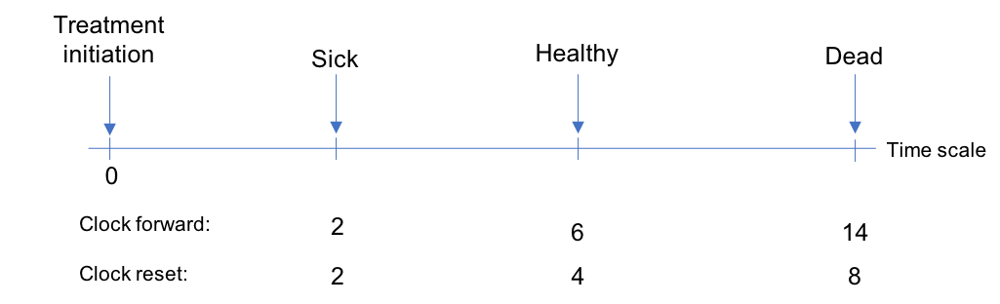

```{r, include = FALSE}
library("knitr")
library("kableExtra")
library("data.table")
library("hesim")
library("ggplot2")
```

# Introduction
- Markov models are the most commonly used models for economic evaluation of health technologies

- Due to the Markov assumption, it is not straightforward (requires tunnel states) to incorporate time dependency

- Semi-Markov models can model time dependency in a very flexible manner but require individual patient simulation (IPS), which is computationally expensive

- The [`hesim`](https://hesim-dev.github.io/hesim/) package provides a general framework for simulating semi-Markov models very quickly and using them to perform cost-effectiveness analysis (CEA)

# What is `hesim`?
> - A modular and computationally efficient `R` package for health economic simulation modeling and decision analysis that provides a general framework for integrating statistical analyses with economic evaluation

- Supports both cohort and **individual-level** state transition models

- Parameterized by fitting a statistical model (e.g., multi-state model) or creating a custom parameter object

- Nearly all simulation code written in `C++` under the hood

# `hesim` integrates the entire modeling process {.flexbox .vcenter}
```{r, out.width = "\\textwidth", echo = FALSE}
knitr::include_graphics("econ-eval-process-hesim.png")
```

# Parameterization with multi-state models
\begin{columns}
\begin{column}{0.45\textwidth}
\small
\begin{itemize}
\item Multi-state models can be used to parameterize the disease model

\item Estimate hazard functions for each possible transition while properly accounting for censoring
\end{itemize}
\end{column}

\begin{column}{0.55\textwidth}
\centering \small Reversible illness death model
```{r, out.width = ".95\\textwidth", fig.align = "center", echo = FALSE}
knitr::include_graphics("illness-death.png")
```
\end{column}
\end{columns}

# Fitting multi-state models in `R`

```{r, echo = FALSE} 
c1 <- c("Parametric and spline models", 
        "Non-parametric and semi-parametric models", 
        "Exponential and piecewise exponential models",
        "Multi-state network meta-analysis")
c2 <- c("flexsurv",
        "mstate", 
        "msm",
        "rjags/rbugs/rstan")
c3 <- c("Continuously observed processes",
        "Continuously observed processes",
        "Panel data", 
        "Summary data from RCTs")
tbl <- data.table("Statistical method" = c1,
                  "R package" = c2,
                  "Data" = c3)
knitr::kable(tbl, format = "latex", booktabs = TRUE) %>%
  kable_styling(full_width = TRUE, font_size = 9, latex_options = "striped",
                stripe_color = "red") %>%
  column_spec(1, width = ".35\\\\textwidth")  
```


# Timescales   

+ **Markov (i.e., "clock forward")** implies that the hazard function is based on time since entering the initial state
+ **semi-Markov (i.e., "clock reset")** implies that the hazard function is based on time since entering each state (i.e., the clock resets to 0 after each transition)

```{r, out.width = "100%", fig.align = "center", echo = FALSE}

```

# Parameter estimation of clock-reset model with `flexsurv`

\small 
```{r, eval = FALSE}
for (i in 1:4)){ # 4 transitions in reversible illness-death model
  wei_fits_cr[[i]] <- flexsurvreg(Surv(years, status) ~ factor(strategy_id),
                                  data = mstate_data,
                                  subset = (trans == i),
                                  dist = "weibull")
}
wei_fits_cr <- flexsurvreg_list(wei_fits_cr)
```

# Parameters in `hesim` can also be created without fitting a model in `R` 
\vspace{1em}

\small
```{r, eval = FALSE}
transmod_params <- params_surv_list(
  # 1. Healthy -> Sick
  params_surv(coefs = list(rate = healthy_to_sick_rate),
              dist = "exp"),
  
  # 2. Healthy -> Dead
  params_surv(coefs = list(rate = healthy_to_dead_rate),
              dist = "exp"),

  # 3. Sick -> Dead
  params_surv(coefs = list(shape = sick_to_dead_shape,
                           scale = sick_to_dead_scale),
              dist = "weibullPH")
)
```

# Simulating disease progression
- IPS is required to simulate clock-reset models; can also be used for clock-forward models

- IPS works by simulating trajectories through the multi-state model with random number generation for a large number of patients

- Purpose of IPS is to compute expected values, which is operationalized by averaging over a large number of simulatd patients 

# Individual patient simulation for multi-state models

\begin{itemize}
% All slides
\item Simulate times to all competing health state and transition to state with smallest sampled time

% Slide 2 only
\only<2>{
\item In \textbf{clock-reset} models sampling can be performed using standard survival distributions; in a \textbf{clock-forward} model sampling must be performed from truncated distributions since time does not reset 
}

% Slide 3 onwards
\only<3->{
\item Let's consider a clock-reset simulation
}
\end{itemize}


\begin{center}
\begin{tikzpicture}

% Slide 4 onwards
\visible<4->{
\node (A) at (0, 0) {Healthy};
\node (B) at (2, 1) {Sick};
\draw [->] (A) -- node[above] {3} (B);
}

% Slide 4 only
\visible<4>{
\node (C) at (2, -1) {Dead};
\draw [->,  dash dot] (A) -- node[above] {8} (C);
}

% Slide 5 only
\visible<5>{
\node (D) at (4, 0) {Healthy};
\draw [->,  dash dot] (B) -- node[above] {5} (D);
}

% Slide 5 onwards
\visible<5->{
\node (E) at (4, 2) {Dead};
\draw [->] (B) -- node[above] {4} (E);
}

\end{tikzpicture}
\end{center}

\visible<7>{
% Slide 7
\begin{itemize}
\item Patient transitions from (i) healthy to sick at year 3 and (ii) from sick to death at year 7
\end{itemize}
}

# Computational efficiency
- `hesim` uses `C++` to vectorize over treatment strategies, patients, and PSA iterations. 

- Simulation is very fast if efficient random number generation functions have been implemented in base `R` or a closed-form expression exists for the quantile function (all parametric distributions)

- If not (e.g., splines, fractional polynomials), simulation is slower. Must either:

    + Compute quantile function numerically and use inverse CDF method
    + Use discrete time approximation and sample from Bernoulli distribution
    
# Simulating disease progression with `hesim`

\small
```{r, eval = FALSE}
transmod_cr <- create_IndivCtstmTrans(wei_fits_cr, input_data,
                                      trans_mat = tmat, n = 1000,
                                      clock = "reset",
                                      start_age = patients$age)
econmod_cr <- IndivCtstm$new(trans_model = transmod_cr)
econmod_cr$sim_disease()
```

\footnotesize
\begin{verbatim}
##    sample strategy_id patient_id grp_id from to final time_start  time_stop
## 1:      1           1          1      1    1  2     0  0.0000000  0.4426233
## 2:      1           1          1      1    2  1     0  0.4426233  0.8347335
## 3:      1           1          1      1    1  3     1  0.8347335 10.1059473
## 4:      1           1          2      1    1  3     1  0.0000000  2.3750032
## 5:      1           1          3      1    1  2     0  0.0000000  1.0297401
## 6:      1           1          3      1    2  1     0  1.0297401  5.1060423
\end{verbatim}

# Simulating costs and QALYs
- Costs and QALYs are computed using the continuous time present value given a flow of state values

$$
\sum_{m = 1}^M \int_{t_m}^{t_m+1} z_{hm}e^{-rt}dt = \sum_{m = 1}^M z_{hm} \left(\frac{e^{-r{t_{m}}} - e^{-r{t_{m+1}}}}{r}\right)
$$

- The present value for health state $h$, $z_h$, can be predicted from a statistical model or predefined; can vary by treatment strategy, patient, and/or time.

- IPS is advantageous because state values can reset (e.g., costs in oncology can depend on time in progressed state due to changes in chemotherapy cycles)

# Parameterizing costs and QALYs with `hesim` 
\begincols
\begincol{0.5\textwidth}
```{r, eval = FALSE}
utility_tbl <- stateval_tbl(
  data.table(state_id = c(1, 2),
             mean = c(1, .7), 
             se = c(0, .2)),
  dist = "beta",
  hesim_data = hesim_dat) 
```
\endcol

\begincol{0.5\textwidth}
\begin{verbatim}
##    state_id mean se
## 1:        1 1.0  0.0
## 2:        2 0.7  0.2
\end{verbatim}
\endcol

\endcols

# Simulating costs and QALYs and performing CEA with `hesim` 
\vspace{1em}

\small
```{r, eval = FALSE}
# Construct utility and cost models
utilitymod <- create_StateVals(utility_tbl, n = 1000)
econmod_cr <- IndivCtstm$new(trans_model = transmod_cr,
                             utility_model = utilitymod,
                             cost_models = costmods)

# Simulate costs and QALYs
econmod_cr$sim_qalys(dr = c(0,.03))
econmod_cr$sim_costs(dr = 0.03)

# Perform cost-effectiveness analysis
ce <- econmod_cr$summarize()
cea(ce, dr_qalys = .03, dr_costs = .03)
cea_pw(ce_sim, comparator = 1, dr_qalys = .03, dr_costs = .03)
```

# Speed tests
- [Comparison](https://devinincerti.com/2019/01/01/sim-mstate.html) of `$sim_disease()` to `mstate::mssample()` using Weibull 6-state model 

    + 1,000 patients, 100 PSA iterations: `hesim`= .44 seconds, `mstate` = 34 minutes
    + 1,000 patients, 1,000 PSA iterations: `hesim` = 5 seconds, `mstate` = N/A
    
- Comparison of `hesim` IPS (1,000 patients) to `heemod` cohort model (60 annual cycles) used to model two treatment strategies with the time-inhomogeneous Markov model from the [*Decision Modeling for Health Economic Evaluation*](https://www.herc.ox.ac.uk/downloads/decision-modelling-for-health-economic-evaluation) textbook

    + 1,000 PSA iterations: `hesim` = 9 seconds, `heemod` = 85 seconds \footnote{Run time for an equivalent cohort model in \texttt{hesim} was $\approx$ 1 second.}

# Summary

- Semi-Markov models are flexible because they can track patient history; hazards, costs, and/or utility can all depend on time in state (not just model time) 

- Although they can only be simulated in a general manner with IPS, `hesim` eliminates concerns about slow run times

- In addition to simulating disease progression, `hesim` can be used to (i) simulate cost/QALYs and (ii) perform CEA

- Some potential features to add: (i) function to update covariates during IPS, (ii) integration with multi-state network meta-analysis, and (iii) support for parallel computing.

- Learn more and see new updates at [https://hesim-dev.github.io/hesim/](https://hesim-dev.github.io/hesim/)


