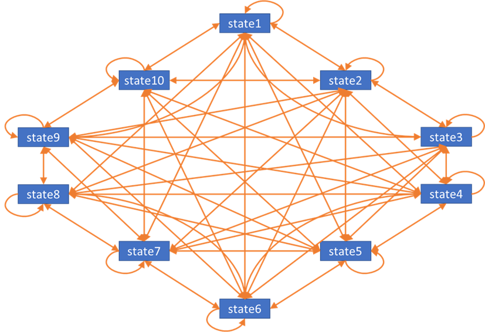

```{r setup, include=FALSE}
options(htmltools.dir.version = FALSE)
options(knitr.table.format = "html")
knitr::opts_chunk$set(warning = FALSE, message = FALSE)

library(dplyr)
library(kableExtra)
library(hermes6)

## Pre-define calculations used below 


```


# Why optimise? 

Many stochastic elements in health economics analysis such as bootstrapping, probabilistic sensitivity analyses, Monte-Carlo simulations etc. 

- Repetitive / messy code
- Time consuming to run
- Memory issues

--

Optimising your code may resolve these problems. Also makes it easier to correct error, and makes your code neater and more readable. 


---

Consider a dummy example where we want to estimate the average cost and standard error around this cost of treatment from a sample of 100 patients. 

```{r}
## Create dummy dataset
n_sample <- 100

df <- data.frame(id = c(1:n_sample), 
                 cost = rnorm(n_sample, 50, 3))
```


```{r echo = FALSE}
df[1:5,] %>% 
  kable(caption = "First 5 patients in dummy dataset", table.attr = "style='width:50%;'") 
```


---

To obtain the standard error, we perform bootstrapping with 500 re-samples. 

```{r eval = FALSE}
## Create empty vector to store mean cost in each bootstrap sample
boot_mean <- numeric()

## Sample without replacement and calculate mean for each bootstrap sample 
boot_mean[1] <- mean(sample(df$cost, n_sample, replace = FALSE)) 
boot_mean[2] <- mean(sample(df$cost, n_sample, replace = FALSE)) 
... 
## Keep repeating this code 500 times
...
boot_mean[500] <- mean(sample(df$cost, n_sample, replace = FALSE)) 

```


--
<br />
<center> But wait... </center>
--
<br />
<center> After all that copying-and-pasting... </center>
--
<br />
<center> You now realized you should have sampled with replacement! </center>

---
class: middle


<center></center>


---

# Using functions and loops

Wrapping the task you want to run repetitively in a function

```{r}
calculate_boot_mean <- function(data, n, replacement){
  mean(sample(data, n, replace = replacement)) 
}

```

Using a `for` loop to perform task iteratively

```{r eval = FALSE}

boot_mean <- numeric()

for(i in c(1:500)){
  boot_mean[i] <- calculate_boot_mean(
    data = df$cost, n = n_sample, replacement = TRUE)
}

```

--

✓ Easier to debug and correct error

--

__? What is R actually doing in each iteration of the `for` loop?__

---

## `for` loops 

```{r eval = FALSE}
boot_mean <- numeric()

for(i in c(1:500)){
  boot_mean[i] <- calculate_boot_mean(
    data = df$cost, n = n_sample, replacement = TRUE)
}
```

- Re-sizing vector `boot_mean` and re-allocating memory for it
- Temporary variable `i` created and gets updated in the global environment 

<!-- For more complex code, you may have several temporary variables being created within the loop -->

--

```{r eval = FALSE}
boot_mean <- numeric(500) #<<

for(i in c(1:500)){
  boot_mean[i] <- calculate_boot_mean(
    data = df$cost, n = n_sample, replacement = TRUE)
}
```

✓ Pre-allocate a vector that fits all values to avoid re-sizing/re-allocating memory 

<!-- But subject to mispecification of vector size -->

---

# Functional programming

- A functional is a function that takes a function as an input, applies the function iteratively to each element in a list and returns the results
- This can be achieved using functions from the `apply()` family<sup>†</sup>
- Runs `for` loop internally in C


```{r eval = FALSE}
boot_mean <- lapply(c(1:500), function(i){
  calculate_boot_mean(data = df$cost, n = n_sample, replacement = TRUE)
})
```


.footnote[
[†] Read more about the `apply()` family of functions in [Carlo Fanara | Datacamp tutorial on the R Apply Family](https://www.datacamp.com/community/tutorials/r-tutorial-apply-family). Functional programming can also be implemented using the `map()` family of functions in [`purrr`](https://purrr.tidyverse.org/). More details in [Garrett Grolemund & Hadley Wickham | R for Data Science - Chapter 21 Iteration](https://r4ds.had.co.nz/iteration.html)
]

--

✓ No need to pre-define vector for storing results

✓ Variables in working environment unaffected

✓ Makes parallelisation easy 


---

__? Is it faster?__

--

```{r eval = FALSE}
boot_mean <- numeric(500) 

for(i in c(1:500)){
  boot_mean[i] <- calculate_boot_mean(
    data = df$cost, n = n_sample, replacement = TRUE)
}
```

Median time taken = `r time_loop <- round(bench::mark(for(i in c(1:500)){calculate_boot_mean(data = df$cost, n = n_sample, replacement = TRUE)})$median*1000,2); time_loop`ms


```{r eval = FALSE}
boot_mean <- lapply(c(1:500), function(i){
  calculate_boot_mean(data = df$cost, n = n_sample, replacement = TRUE)
})
```

Median time taken = `r time_lapply <- round(bench::mark(lapply(c(1:500), function(i){calculate_boot_mean(data = df$cost, n = n_sample, replacement = TRUE)}))$median*1000,2); time_lapply`ms

--

___Sometimes___ 


---

# Vectorisation  

- Many operations in R are vectorised 
- Instead of working on each element of the vector individually (as in the case of loops), it works on the entire vector. 

```{r, echo = TRUE, eval = FALSE}
vector1 <- c(1:4); vector2 <- c(6:9)

## Element-wise computation
sum <- numeric(length(vector1))
for(i in seq_along(vector1)) {
  sum[i] <- vector1[i] + vector2[i]
}

## Vectorised computation 
vector1 + vector2
```


.footnote[
1. [Hadley Wickham | Advanced R - Chapter 24.5 Vectorise](https://adv-r.hadley.nz/perf-improve.html#vectorise)
2. [Patrick Burns | The R Inferno - Chapter 3 Failing to Vectorize](http://www.burns-stat.com/pages/Tutor/R_inferno.pdf)
]

---

Suppose we want to test in our dummy cost dataset if the cost of treatment is more than £50. 

```{r eval = FALSE}
## Element-wise computation
lapply(seq_along(df$cost), function(i){df$cost[i] > 50})
```
Median time taken = `r time_lapply_logictest <- round(bench::mark(lapply(seq_along(df$cost), function(i){df$cost[i] > 50}))$median*1000000,2); time_lapply_logictest`µs

```{r eval = FALSE}
## Vectorised computation 
df$cost > 50
```
Median time taken = `r round(bench::mark(df$cost > 50)$median*1000000,2)`µs

---

# Parallelisation

- Running several processes simultaneously on multiple processors/cores of the computer
- Many different packages to achieve this. Some examples:
  + [parallel](https://stat.ethz.ch/R-manual/R-devel/library/parallel/doc/parallel.pdf)::mclapply()
  + [future](https://cran.r-project.org/web/packages/future/vignettes/future-1-overview.html)
      + [furrr](https://davisvaughan.github.io/furrr/)::future_map()
  + [foreach](https://cran.r-project.org/web/packages/foreach/vignettes/foreach.html) & [doParallel](https://cran.r-project.org/web/packages/doParallel/vignettes/gettingstartedParallel.pdf)
  + [snowfall](https://cran.r-project.org/web/packages/snowfall/vignettes/snowfall.pdf)

.footnote[
Some useful resources on parallelising
1. [Max Gordan | How-to go parallel in R – basics + tips](http://gforge.se/2015/02/how-to-go-parallel-in-r-basics-tips/)
2. [CRAN Task View: High-Performance and Parallel Computing with R](https://cran.r-project.org/web/views/HighPerformanceComputing.html)
]

---

# Parallelising your code


```{r eval = FALSE, warning = FALSE}

boot_mean <- furrr::future_map(c(1:500), function(i){
  calculate_boot_mean(
    data = df$cost, n = n_sample, replacement = TRUE)
})

```

Median time taken = `r round(bench::mark(furrr::future_map(c(1:500), function(i){calculate_boot_mean(data = df$cost, n = n_sample, replacement = TRUE)}))$median*1000,2)`ms (previously `r time_lapply`ms)

```{r eval = FALSE}
furrr::future_map(seq_along(df$cost), function(i){df$cost[i] > 50})
```

Median time taken = `r round(bench::mark(furrr::future_map(seq_along(df$cost), function(i){df$cost[i] > 50}), time_unit = "s")$median*1000,2)`ms (previously `r time_lapply_logictest/1000`ms)

--

__? Parallelising here is actually _SLOWER_?__

---

### One of the caveats of parallelisation: overhead time<sup>†</sup> 
- Each parallel process has its own memory space and data/package needs to be loaded across them all
- A "start-up" time is required before actual computation occurs
- Need to weigh up the cost-benefit of using parallelisation
  + Usually cost > benefit for smaller task


.footnote[
[†] Read more about this in [Imre Gera | Parallelization caveats in R #1: performance issues](https://towardsdatascience.com/parallelization-caveats-in-r-1-the-basics-multiprocessing-and-multithreading-performance-eb584b7e850e)
]


---

# Other ways to optimise your code

### Break down the task

#### Make your function do as little as possible

```{r}
df_cost <- df$cost

boot_mean <- lapply(c(1:500), function(i){
  calculate_boot_mean(
    data = df_cost, n = n_sample, replacement = TRUE)
})
```

Median time taken = `r round(bench::mark(lapply(c(1:500), function(i){calculate_boot_mean(data = df_cost, n = n_sample, replacement = TRUE)}))$median*1000,2)`ms (previously `r time_lapply`ms)

- Dimension reduction

---

### Break down the task

#### Do pre-calculations

e.g. Very simple simulation model (finite combination of states) predicting the state patient is in, and performing costs and QALYs calculation in each cycle 

- Pre-calculate costs/QALYs for all possible combinations of states 
- Apply pre-calculations after simulation 

--

### Using a faster language 

Sometimes R is just slow. But R has interfaces to other faster languages via packages. 

- C++: [Rcpp](http://www.rcpp.org/) [probably the most popular]
- Python: rPython
- Java: rJava

---

# Case study with a markov model

### Acknowledgements


Materials used in this case study is based on the work conducted as part of the 2019 R for Health Economics Hackathon. The team behind this work comprise of: 

- Howard Thom, University of Bristol
- Iryna Schlackow, University of Oxford
- Mi Jun Keng, University of Oxford
- Robert Ashton, Imperial College London
- Sam Abbott, London School of Hygiene and Tropical Medicine
- Amy Chang, University of Sheffield
- Han Fu, Imperial College London
- Houra Haghpanahan, University of Glasgow
- Zoe Turner, Nottinghamshire Healthcare NHS Foundation Trust

The R code for the original work is accessible from [GitHub](https://github.com/HealthEconomicsHackathon/hermes6).

.footnote[
For an implementation of this work, see Sam Abbott's package [`SpeedyMarkov`](https://github.com/seabbs/SpeedyMarkov) (presentation on 12th October 0910-0935)
]

---

Markov model with 10 states (time-homogeneous; all transitions permitted)





- `n.treatments = 2` | no. of treatment arms 
- `n.samples = 25000` | no. of PSA samples
- `n.cyles = 100` | number of cycles to run

```{r setup-markov-time, eval = TRUE, echo = FALSE}

# define how tx|smp|cycle modeled 
ordered_time <- rbind(
  base = c("for loop", "for loop", "for loop"), 
  lapplytx = c("lapply", "for loop", "for loop"), 
  lapplysmp = c("for loop", "lapply", "for loop"), 
  parallelisesmp = c("for loop", "parallel", "for loop"), 
  lapplytx_vectorisesmp = c("lapply", "vectorised", "for loop"), 
  lapplytx_rcppcycle = c("lapply", "for loop", "rcpp")
) %>% 
  `colnames<-`(c("tx", "smp", "cycle")) %>%
  as_tibble(rownames = "name") 

df_median_runtime <- readRDS("src/df_benchmark.rds") %>% 
  mutate(name = as.character(expression)) %>% 
  select(name, median) %>% 
  slice(match(ordered_time$name, name)) %>% 
  left_join(ordered_time) %>% 
  select(name, tx, smp, cycle, median) %>% 
  mutate_at(vars("tx", "smp", "cycle"), ~ cell_spec(., color = 
                                                      case_when(. == "lapply" ~ "blue", 
                                                                . %in% c("vectorised", "parallel", "rcpp") ~ "red",
                                                                TRUE ~ "black")))

# Pre-define column names
colname_runtime <- c("Tx", "PSA sample", "Cycle", "Median time across 20 iterations")

```


---

Extract of code for Markov model (minimal, non-executable)
```{r markov_expanded, eval = FALSE}
# Loop over the treatment options
for(i.treatment in 1:n.treatments){ #<<
  
  # Extract transition matrix for treatment
  transition.matrices_tr <- transition.matrices[i.treatment,,,]
    
  # Loop over the PSA samples
  for(i.sample in 1:n.samples){ #<<
    
    transition.matrices_tr_sample <- transition.matrices_tr[i.sample,,]
    
    # Loop over the cycles
    for(i.cycle in 2:n.cycles){ #<<
      
      # Markov update  
      cohort.vectors[i.treatment, i.sample,i.cycle,]<-
        cohort.vectors[i.treatment, i.sample,i.cycle-1,] %*%
        transition.matrices_tr_sample
    }
    
    cohort.vectors_tr_sample <- cohort.vectors[i.treatment,i.sample,,]
  }
}

```


---

class: center, middle

```{r echo = FALSE}

df_median_runtime %>% 
  filter(name %in% c("base")) %>% 
  select(-name) %>% 
  kable(col.names = colname_runtime, digit = 2, escape = FALSE) 

```


---

### `lapply()` over treatments 

```{r markov_expanded_lapply, eval = FALSE}
# Functional loop over treatment options
lapply(c(1:n.treatments), function(i.treatment){  #<<
  
  transition.matrices_tr <- transition.matrices[i.treatment,,,]
  ## Dimension reduction 
  cohort.vectors_tr <- cohort.vectors[i.treatment,,,] 
  
  for(i.sample in 1:n.samples){ 
    
    transition.matrices_tr_sample <- transition.matrices_tr[i.sample,,]
    ## Dimension reduction 
    cohort.vectors_tr_sample <- cohort.vectors_tr[i.sample,,] 
    
    for(i.cycle in 2:n.cycles){ 
      
      cohort.vectors_tr_sample[i.cycle,] <- cohort.vectors_tr_sample[i.cycle-1,] %*% transition.matrices_tr_sample
    }
  }
})
```


---
class: center, middle

```{r echo = FALSE}

df_median_runtime %>% 
  filter(name %in% c("base", "lapplytx")) %>% 
  select(-name) %>% 
  kable(col.names = colname_runtime, digit = 2, escape = FALSE) 

```


---

### `lapply()` over PSA samples
```{r markov_expanded_vectorisesmp, eval = FALSE}
for(i.treatment in c(1:n.treatments)){ 
  
  transition.matrices_tr <- transition.matrices[i.treatment,,,]
  cohort.vectors_tr <- cohort.vectors[i.treatment,,,]
  
  # Functional loop over PSA samples
  lapply(c(1:n.samples), function(i.sample){ #<<
    
    transition.matrices_tr_sample <- transition.matrices_tr[i.sample,,]
    cohort.vectors_tr_sample <- cohort.vectors_tr[i.sample,,]

    for(i.cycle in 2:n.cycles){ 
      
      cohort.vectors_tr_sample[i.cycle,] <-
        cohort.vectors_tr_sample[i.cycle-1,] %*%
        transition.matrices_tr_sample
    }
  }) 
}

```


---
class: center, middle

```{r echo = FALSE}

df_median_runtime %>% 
  filter(name %in% c("base", "lapplytx", "lapplysmp")) %>% 
  select(-name) %>% 
  kable(col.names = colname_runtime, digit = 2, escape = FALSE) 

```

---

### `mclapply()` over PSA samples

```{r markov_expanded_parallisesmp_mclapply, eval = FALSE}
for(i.treatment in c(1:n.treatments)){ 

  transition.matrices_tr <- transition.matrices[i.treatment,,,]
  cohort.vectors_tr <- cohort.vectors[i.treatment,,,]

  # Parallelised over PSA samples
  furrr::future_map(c(1:n.samples), function(i.sample){ #<<
  
    transition.matrices_tr_sample <- transition.matrices_tr[i.sample,,]
    cohort.vectors_tr_sample <- cohort.vectors_tr[i.sample,,]

    for(i.cycle in 2:n.cycles){ 
      
      cohort.vectors_tr_sample[i.cycle,] <- cohort.vectors_tr_sample[i.cycle-1,] %*% transition.matrices_tr_sample
    }
  }) 
}
```

---
class: center, middle


```{r echo = FALSE}

df_median_runtime %>% 
  filter(name %in% c("base", "lapplytx", "lapplysmp", "parallelisesmp")) %>% 
  select(-name) %>% 
  kable(col.names = colname_runtime, digit = 2, escape = FALSE) 

```

---

### `lapply()` over treatments & vectorised operation over samples

```{r markov_expanded_lapply_vectorise, eval = FALSE}
# Functional loop over the treatment options
lapply(c(1:n.treatments), function(i.treatment){ #<<
  
  transition.matrices_tr <- transition.matrices[i.treatment,,,]
  cohort.vectors_tr <- cohort.vectors[i.treatment,,,]

  for(i.cycle in 2:n.cycles){
    
    ## Reformulated such that vectorised operation over PSA samples
    for(i.state in 1:n.states){ #<<
       cohort.vectors_tr[ ,i.cycle,i.state]<- #<<
         rowSums(cohort.vectors_tr[ ,i.cycle-1, ] * #<<
                   transition.matrices_tr[,,i.state]) #<<
    } #<<
  }
})
```

---

class: center, middle


```{r echo = FALSE}

df_median_runtime %>% 
  filter(name %in% c("base", "lapplytx", "lapplysmp", "parallelisesmp", "lapplytx_vectorisesmp")) %>% 
  select(-name) %>% 
  kable(col.names = colname_runtime, digit = 2, escape = FALSE) 

```

---

### `lapply()` over treatments & `rcpp_loop()` over cycles

```{r markov_expanded_lapply_rcpp, eval = FALSE}
# Functional loop over the treatment options
lapply(c(1:n.treatments), function(i.treatment){ #<<
  
  transition.matrices_tr <- transition.matrices[i.treatment,,,]
  cohort.vectors_tr <- cohort.vectors[i.treatment,,,]
  
  for(i.sample in 1:n.samples){ 
    
    transition.matrices_tr_sample <- transition.matrices_tr[i.sample,,]
    
    cohort.vectors_tr_sample <- cohort.vectors_tr[i.sample,,]
    
    # Loop over the cycles using Rcpp
    cohort.vectors_tr_sample <- #<<
      rcpp_loop(mat_in = cohort.vectors_tr_sample, #<<
                transition = transition.matrices_tr_sample, #<<
                n = n.cycles) #<<
  } #<<
})
```

---

class: center, middle


```{r echo = FALSE}

df_median_runtime %>% 
  filter(name %in% c("base", "lapplytx", "lapplysmp", "parallelisesmp", "lapplytx_vectorisesmp", "lapplytx_rcppcycle")) %>% 
  select(-name) %>% 
  kable(col.names = colname_runtime, digit = 2, escape = FALSE) 

```

---

class: center

### How to optimise? 

Functionals | Vectorising | Parallelising etc.

--

## What should you optimise? 

Always aim for readability | Profile your code to find bottlenecks<sup>†</sup>

.footnote[

[†] One way to easily profile your code is with [`profvis`](https://rstudio.github.io/profvis/). More about code profiling in [Hadley Wickham | Advanced R - Chapter 23 Measuring performance](https://adv-r.hadley.nz/perf-measure.html)

]

--

# Should you even optimise at all? 

First make it work correctly. Then, perhaps.

--

<blockquote><i>
We should forget about small efficiencies, say about 97% of the time: premature optimization is the root of all evil. — Donald Knuth 
</i></blockquote>


---


# References


```{r print-refs, echo=FALSE, eval=TRUE, results='asis'}
library(RefManageR)
bib <- ReadBib("rhta_markovspeedup.bib", check = FALSE)
print(bib, .opts = list(style = "html", bib.style = "authoryear"))
```

